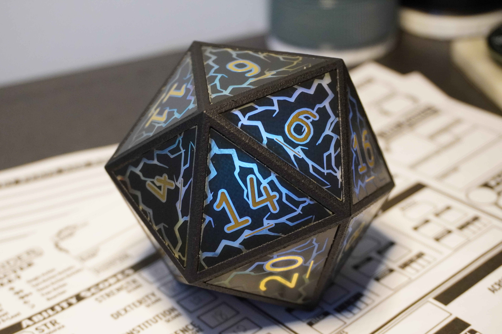

# Big Electronic D20

This project began several years ago, before pixel dice became widely available. Inspired by existing designs but aiming for something unique, this marks my first foray into PCB art. By adding artwork to the solder mask layer, the FR4 substrate is exposed, allowing light to shine through. Combined with a 3D-printed frame, a mainboard featuring LEDs, and an IMU, the result is a visually striking D20 that comes to life when rolled.

## Showcase

## Faces

- Each face is an equilateral triangle, 1.5" per edge.
- Single-sided PCBs with gold-plated numbers.
- Solder mask is relieved around each number for clear illumination.
- Lightning patterns are masked out for added visual interest.
- Designs were refined following prototype testing with various patterns.

## Frame

- Constructed from MJF-printed nylon in an icosahedral shape.
- Features inset shelves for gluing PCB faces.
- Includes cut-outs along two opposing spokes to accommodate the rectangular mainboard.

## Mainboard

- STM32L412KB microcontroller.
- LIS2DW12 MEMS IMU.
- 32 addressable LEDs.
- Voltage regulators and LiPo battery charging circuitry.
- Ultra-low power design: enters deep sleep mode when not in use.

### Operation

- The IMU detects motion, waking the microcontroller.
- LEDs activate and display a lightning animation while the die is in motion.
- The IMU is regularly polled during animation.
- When the die comes to rest, a final measurement determines the top face using cosine similarity.
- The face value determines the display color: pure red for 1, pure green for 20, with a linear gradient for intermediate values.
- The color is shown for a few seconds before returning to sleep mode.

### Power Consumption

- At rest: ~5μA, yielding a theoretical shelf life of ~5 years with a 400mAh battery.
- During operation: ~50mA, for a theoretical runtime of ~10 hours.
- Designed for intermittent use, suitable for multiple gaming sessions per charge.
